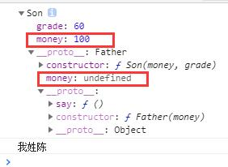
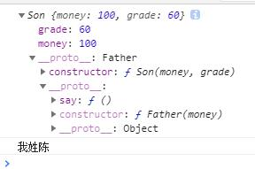
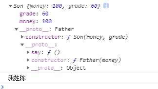

## 2021/4/16 学习了如何优化之前 es5 中构造函数的继承

- 原本的继承方法如下：

```js
function Father(money) {
  this.money = money;
}

Father.prototype.say = function () {
  console.log("我姓陈");
};

function Son(money, grade) {
  Father.call(this, money);
  this.grade = grade;
}

Son.prototype = new Father();
Son.prototype.constructor = Son;

const p = new Son(100, 60);
console.log(p);
p.say();
```

- 但是这样存在一个问题，如下图中

  

- 子类实例上已经有一个 money 属性，但是它的\_\_proto\_\_上还有一个 money 属性继承于父类，显得多余
- 因此可以用以下的改进方法

```js
function Father(money) {
  this.money = money;
}

Father.prototype.say = function () {
  console.log("我姓陈");
};

function Son(money, grade) {
  Father.call(this, money);
  this.grade = grade;
}

function create(obj) {
  function f() {}
  f.prototype = obj;
  return new f();
}

Son.prototype = create(Father.prototype);
Son.prototype.constructor = Son;

const p = new Son(100, 60);
console.log(p);
p.say();
```

- 上面代码执行结果如下：

  

- 可以看到\_\_proto\_\_上没有空的 money 属性

### 最常用的继承方法

```js
function Father(money) {
  this.money = money;
}

Father.prototype.say = function () {
  console.log("我姓陈");
};

function Son(money, grade) {
  Father.call(this, money);
  this.grade = grade;
}

Son.prototype = Object.create(Father.prototype); // 最常用的方法
Son.prototype.constructor = Son;

const p = new Son(100, 60);
console.log(p);
p.say();
```

- Object.create()的思想实际上与上面的那种方法一样
- Object.create()方法创建一个新对象，使用现有的对象来提供新创建的对象的\_\_proto\_\_
- 执行结果如下

  
