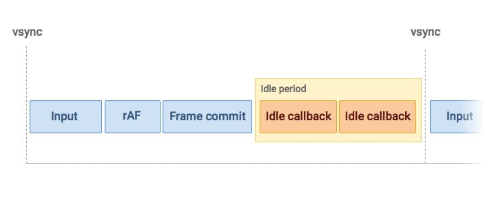

## 如何把十万条数据(数据量非常大)的数据渲染到页面上，同时用户不会感知到卡顿

- 浏览器为单线程，同步渲染数据会导致其他操作没有响应，造成假死现象

```js
<body>
    <input type="text">
    <ul></ul>
    <script>
        const ul = document.querySelector('ul');
        const arr = new Array(100000).fill('数据');
        arr.forEach(ele => {
            const li = document.createElement('li');
            li.style.color = color16();
            li.innerHTML = ele;
            ul.appendChild(li);
        })
        function color16() {
            //十六进制颜色随机
            var r = Math.floor(Math.random() * 256);
            var g = Math.floor(Math.random() * 256);
            var b = Math.floor(Math.random() * 256);
            var rgb = '(' + r + ',' + g + ',' + b + ')';
            return `rgb${rgb}`;
        }
    </script>
</body>

```

- 上面的代码在执行时会渲染完所有数据以后再显示页面，造成卡顿
- 我们希望在渲染的同时，用户的所有操作(输入或者页面动画)都完全不受影响
- 实现方式：主要是用 requestIdleCallback 方法，也可以用 requestAnimationFrame，要看渲染优先级高低

```js
<body>
    <input type="text">
    <ul></ul>

    <script>
        const ul = document.querySelector('ul');

        let index = 0;

        function render(deadline) {
            index++;
            if (index > arr.length) return;
            const li = document.createElement('li');
            li.style.color = color16();
            li.innerHTML = arr[index];
            ul.appendChild(li);
            if (deadline.timeRemaining > 1) {
                render();
            } else {
                window.requestIdleCallback(render);
            }
        }

        window.requestIdleCallback(render);

        function color16() {
            //十六进制颜色随机
            var r = Math.floor(Math.random() * 256);
            var g = Math.floor(Math.random() * 256);
            var b = Math.floor(Math.random() * 256);
            var rgb = '(' + r + ',' + g + ',' + b + ')';
            return `rgb${rgb}`;
        }
    </script>
</body>
```

- 假如某一帧里面要执行的任务不多，在不到 16ms（1000/60)的时间内就完成了上述任务的话，那么这一帧就会有一定的空闲时间
- 这段时间就恰好可以用来执行 requestIdleCallback 的回调，如下图所示

  

- 语法: window.requestIdleCallback(callback[, options])
- callback: 一个在事件循环空闲时即将被调用的函数的引用。函数会接收到一个名为 IdleDeadline 的参数，这个参数可以获取当前空闲时间
- options: 可选 包括可选的配置参数,具有如下属性: timeout;
- 如果指定了 timeout 并具有一个正值，并且尚未通过超时毫秒数调用回调，那么回调会在下一次空闲时期被强制执行，尽管这样很可能会对性能造成负面影响
- 用法: window.requestIdleCallback(render,{timeout: 2000});
