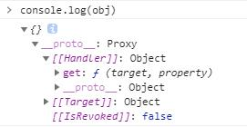
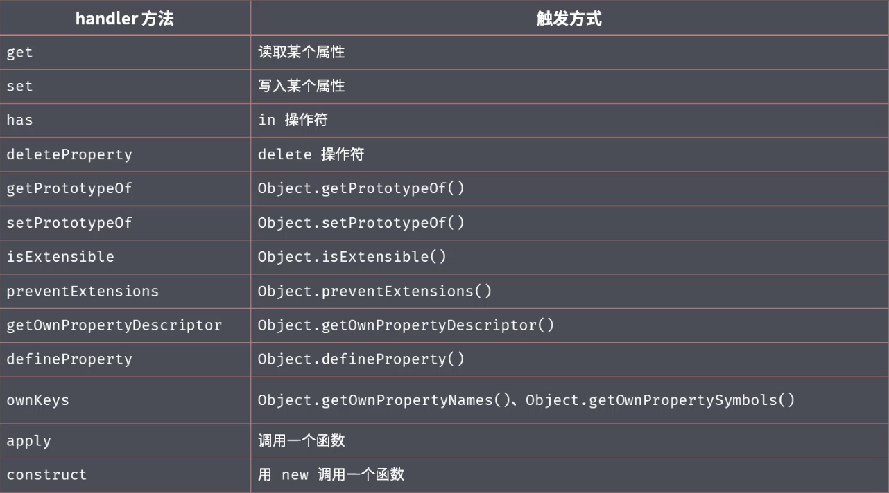

## 4/26 学习了 Proxy

- proxy 在目标对象的外层搭建了一层拦截，外界对目标对象的某些操作，必须通过这层拦截

```js
var proxy = new Proxy(target, handler);
```

- new Proxy()表示生成一个 Proxy 实例，target 参数表示所要拦截的目标对象，handler 参数也是一个对象，用来定制拦截行为

```js
var target = {
  name: "poetries",
};
var logHandler = {
  get: function (target, key) {
    console.log(`${key} 被读取`);
    return target[key];
  },
  set: function (target, key, value) {
    console.log(`${key} 被设置为 ${value}`);
    target[key] = value;
  },
};
var targetProxy = new Proxy(target, logHandler);

targetProxy.name; // 控制台输出：name 被读取
targetProxy.name = "others"; // 控制台输出：name 被设置为 others

console.log(target.name); // 控制台输出: others
```

- targetWithLog 读取属性的值时，实际上执行的是 logHandler.get ：在控制台输出信息，并且读取被代理对象 target 的属性。
- 在 targetWithLog 设置属性值时，实际上执行的是 logHandler.set ：在控制台输出信息，并且设置被代理对象 target 的属性的值

```js
var proxy = new Proxy(
  {},
  {
    get: function (target, property) {
      return 35;
    },
  }
);

proxy.time; // 35
proxy.name; // 35
proxy.title; // 35
```

- 由于拦截函数总是返回 35，所以访问任何属性都得到 35

### 设置 get 和 set

```js
const person = {
  name: "zs",
  age: 20,
};

const personProxy = new Proxy(person, {
  get(target, property) {
    // target源数据
    // property 访问的属性名
    console.log(target, property);

    return property in target ? target[property] : "查无此属性";
  },
  set(target, property, value) {
    if (property === "age") {
      // 如果age不是一个整数，抛出错误
      if (!Number.isInteger(value)) {
        throw new TypeError(`${value}不是一个整数`);
      }
    }
    console.log("设置数据");
  },
});

personProxy.age = "str"; // 报错，内部做了限制

console.log(personProxy.age1); // 查无此属性

personProxy.gender = true;
```

```js
var proxy = new Proxy(
  {},
  {
    get: function (target, property) {
      return 35;
    },
  }
);

let obj = Object.create(proxy);
console.log(obj);
obj.time; // 35
```



- proxy 对象是 obj 对象的原型，obj 对象本身并没有 time 属性，所以根据原型链，会在 proxy 对象上读取该属性，导致被拦截

### Proxy 的作用

- 拦截和监视外部对对象的访问
- 降低函数或类的复杂度
- 在复杂操作前对操作进行校验或对所需资源进行管理

### Proxy 和 defineProperty 的区别

- defineProperty 只能监听对象属性的读写
- Proxy 可以监听更多的操作
  
- 可以监听数组的变动(vue2 重写了数组)
  对数组进行操作时，先修改了第 0 项的内容，再修改了 length 属性，因此调用了两次 set

```js
const arr = [];
const listProxy = new Proxy(arr, {
  set(target, property, value) {
    // set: 0 100
    // set: length 1
    console.log("set:", property, value);
    target[property] = value;
    return true; // 表示设置成功
  },
});
listProxy.push(100);
```

- 以非侵入的方式监管了对象的读写

### Reflect(静态类)

- Reflect 成员方法就是 Proxy 处理对象的默认实现
- 我们一般处理完自己逻辑以后，get 逻辑交给 Reflect 来实现

```js
const obj = {
  foo: "23",
  bar: "456",
};

const proxy = new Proxy(obj, {
  get(target, property) {
    console.log("调用了get");
    return Reflect.get(target, property);
  },
  set(target, property, value) {
    console.log("调用了set");
    return Reflect.set(target, property, value);
  },
});

console.log(proxy.bar);
```

代码的执行结果如下

```cmd
调用了 get
456
```

- Reflect 的作用是提供了一套操作对象的 API

```js
const obj = {
  foo: "23",
  bar: "456",
};

console.log(Reflect.has(obj, "name")); // 是否包含name属性
console.log(Reflect.deleteProperty(obj, "age")); // 删除属性
console.log(Reflect.ownKeys(obj)); // 获取自身属性
```

代码的执行结果如下

```cmd
false
true
[ 'foo', 'bar' ]
```
